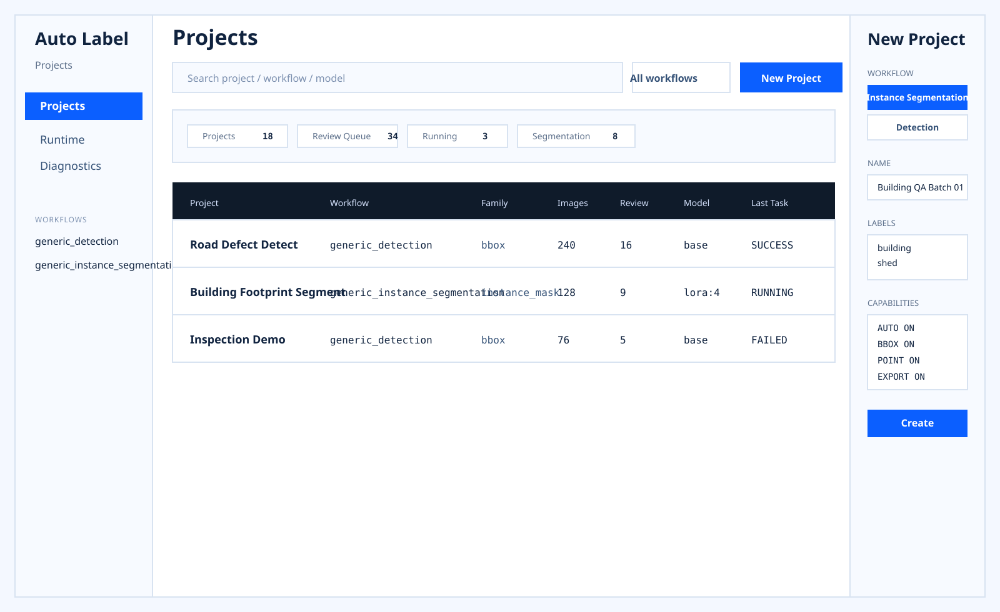
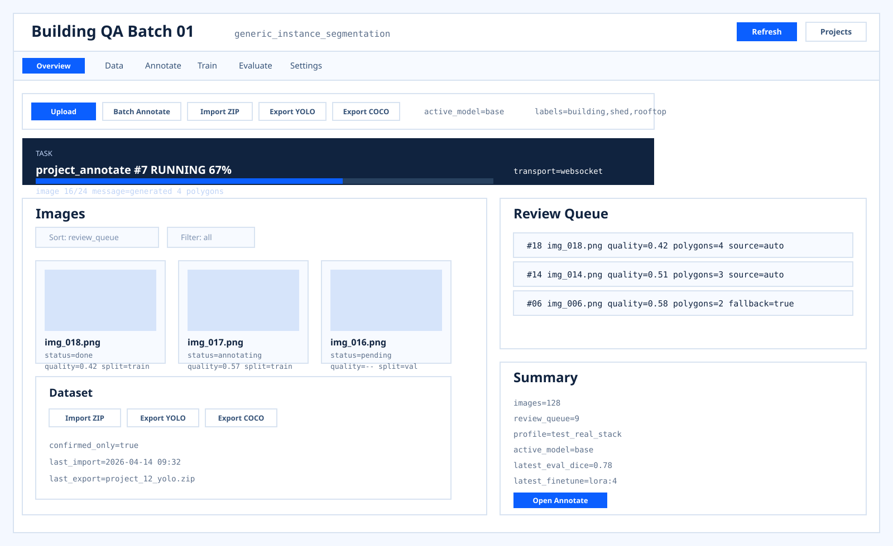
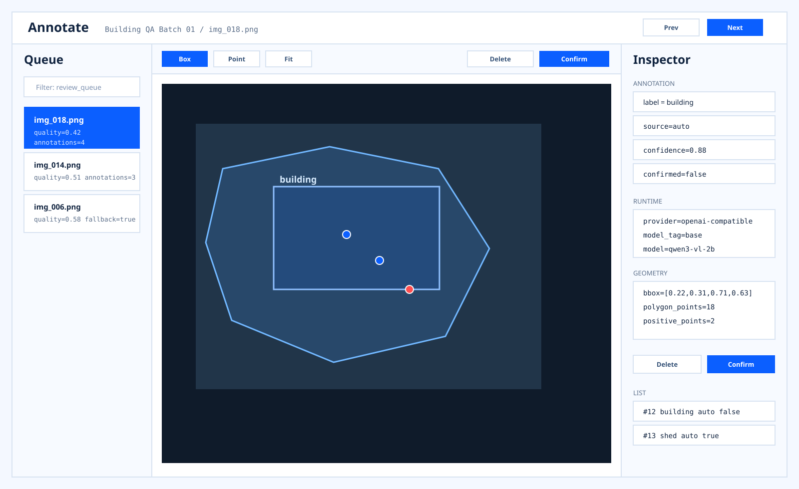
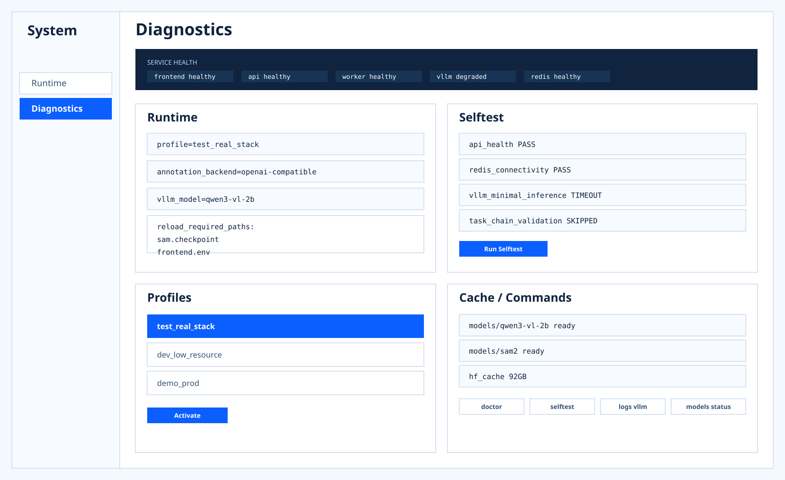

# M20 前端完全重写原型规范

## 1. 风格基线

- 风格：扁平化、蓝白配色、专业软件界面。
- 主色：`#0B5FFF`
- 深色文本：`#10233F`
- 次级文本：`#5C6F8A`
- 线框：`#D8E3F1`
- 页面底色：`#F4F8FF`
- 面板底色：`#FFFFFF`
- 圆角：`4px / 6px / 8px`，不使用大圆角。
- 阴影：默认不用阴影，依靠分区、细边框、留白和层级对比建立结构。
- 字体：`IBM Plex Sans` + `IBM Plex Mono`。

## 2. 动效基线

- 页面切换：`180ms` 淡入 + `12px` 位移。
- 二级标签切换：底部蓝色指示条平移，`160ms`。
- 抽屉与侧栏：`220ms` 滑入滑出。
- 列表筛选 / 排序：使用 FLIP 过渡，`160ms`。
- 任务进度：顶部进度条持续流动，完成后转为静态成功态。
- 图片卡片 hover：边框高亮与底色轻微变化，不放大卡片。
- 画布标注：bbox / polygon / point 的进入与更新使用 `100ms~140ms` 淡入或形变过渡。
- 通知：右上角堆叠式 toast，从右侧滑入，`200ms`。

## 3. 信息白名单

界面上只允许出现以下信息：

- 项目名、workflow、task family、labels、active model
- 图片数量、待复核数量、split、图片状态、质量分
- 任务状态、任务进度、transport、错误信息、最近任务消息
- 标注的 label、source、confidence、confirmed、runtime route、bbox / polygon / points
- profile、runtime settings、reload required paths、服务健康、自检结果、模型缓存状态
- 训练任务、评估指标、失败样本、运行耗时

界面上不保留以下内容：

- 说明性口号
- “此页面负责什么”的提示语
- 设计解释
- 与当前操作无关的长段说明
- 同一字段的重复说明

## 4. 路由骨架

- `/projects`
- `/projects/:projectId/overview`
- `/projects/:projectId/data`
- `/projects/:projectId/annotate`
- `/projects/:projectId/train`
- `/projects/:projectId/evaluate`
- `/projects/:projectId/settings`
- `/runtime`
- `/diagnostics`

## 5. 状态拆分

- `systemRuntimeStore`
  - profile
  - system settings
  - reload required paths
  - service health
- `projectStore`
  - project meta
  - workflow metadata
  - labels
  - active model
- `datasetStore`
  - image list
  - sort / filter / split
  - import / export
  - review queue
- `annotationStudioStore`
  - current image
  - annotation list
  - selected annotation
  - canvas mode
  - correction points
- `runStore`
  - annotate task
  - finetune jobs
  - evaluation runs

## 6. 页面定义

### 6.1 项目中心

原型：

模块：

- 顶部工具栏：搜索、筛选、创建项目
- 项目表：项目名、workflow、family、图片数、待复核、active model、最近任务
- 创建抽屉：workflow 选择、项目名、labels、capabilities 摘要

规则：

- 创建项目必须 workflow-first。
- `task_type` 不作为主选择项，只作为兼容字段。
- 项目列表默认支持按 workflow、待复核数量、最近活动排序。

### 6.2 项目工作台

原型：

模块：

- 顶部标签：Overview / Data / Annotate / Train / Evaluate / Settings
- 主操作区：上传、批量自动标注、导入、导出
- 任务条：状态、进度、transport、最新消息
- 图片区：缩略图、状态、quality、split
- 右侧摘要：review queue、运行摘要、当前 profile / model

规则：

- 批量自动标注状态必须常驻可见。
- 图片默认按 review queue 优先排序。
- 项目级常用数据放这里，系统级设置不放这里。

### 6.3 标注工作台

原型：

模块：

- 左侧：review queue / image queue
- 中间：画布与工具栏
- 右侧：annotation inspector

规则：

- 工具栏由 workflow metadata 控制。
- `supports_point_refine = false` 时不显示点修正入口。
- 确认当前图片后自动进入下一张待复核图片。
- runtime route 必须可见。

### 6.4 运行中心与诊断中心

原型：

模块：

- profile 列表
- runtime settings
- reload required paths
- service health
- selftest report
- model cache / command shortcuts

规则：

- profile 切换结果必须显示 reload required paths。
- `doctor / selftest` 结果按组件展示，不返回笼统状态。
- 宿主机级修复动作默认仍走 CLI。

## 7. workflow 兼容规则

- workflow 是项目创建和设置的主入口。
- 页面能力由 workflow metadata 控制，不再靠页面硬编码分叉。
- 编辑器主交互由 `task_family` 决定：
  - `bbox`：框创建、框确认、框删除
  - `instance_mask`：bbox + polygon + point refine
- 后续新增 workflow 时，优先新增 metadata 和局部工具，不新增整页特判。

## 8. 当前原型文件

- [docs/assets/m20-screen-01-project-hub.svg](/Library/workspace/auto-label-llm/docs/assets/m20-screen-01-project-hub.svg)
- [docs/assets/m20-screen-02-project-workspace.svg](/Library/workspace/auto-label-llm/docs/assets/m20-screen-02-project-workspace.svg)
- [docs/assets/m20-screen-03-annotation-studio.svg](/Library/workspace/auto-label-llm/docs/assets/m20-screen-03-annotation-studio.svg)
- [docs/assets/m20-screen-04-ops-diagnostics.svg](/Library/workspace/auto-label-llm/docs/assets/m20-screen-04-ops-diagnostics.svg)
